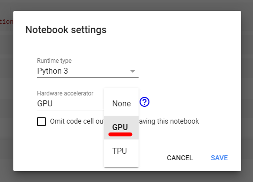
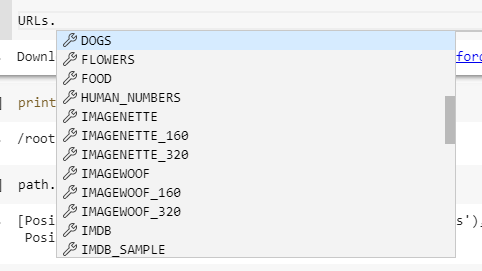
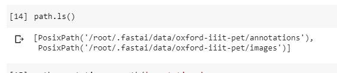

This second tutorial will quickly run through how to run code and some of the basics of Python!

# Python

### What is Python?

### Why are we using it?

### Using Python

### Variables

# FastAI
Fast AI is a Deep Learning Python Library designed to *make Neural Networks uncool again*. By this they mean to make deep learning as accessible as possible to people without programming degrees and access to large datasets.


# Getting Started

### Changing to GPU
Neural Networks run extremely well from your Graphics Processing Unit (GPU), rather than the Central Processing Unit (CPU); by default Google Colab Notebooks run from CPU, so we're going to need to change that.

- Go to the `Runtime` tab at the top of the notebook and click `Change Runtime Type`.


- In the `Hardware Accelerator` drop down menu, change `None` to `GPU` and hit `Save`.


### Refreshing the Notebook
Delete the cells that you have created in your Google Colab notebook and then **create a new Code Cell**, this code cell will restart the Notebooks variables and load a library called *MatPlotLib* which we will use later to draw graphs. Write the following inside of it:

```python
#Reload the Notebook
%reload_ext autoreload
%autoreload 2
%matplotlib inline
```

### Importing FastAI
Google Colab has many libraries freely available to us, so instead of having to go through the tedious task of installing libraries, we just need to **make a code cell** and type the following in to it:

```python
#Import the FastAI Library
import fastai
```

### Importing Specific FastAI modules
We will need to import specific modules from the FastAI Library so that we can make our Pet classifier. Specificly, we will need to import the *Vision* module and the *metrics* module, so **create another code cell below the last one** and write the following:

```python
#Import the Vision and Metrics modules from the FastAI Library
from fastai.vision import *
from fastai.metrics import error_rate
```

### Ignoring some warnings
There are some warnings that Tensorflow produces when we run the following program, but we can just ignore them by putting the following in a Code cell

```python
#Ignore tensorflow warnings
import warnings
warnings.filterwarnings("ignore", category=UserWarning, module="torch.nn.functional")
```

### Setting a Batch Size
To decide how many images we would like to process at once, we can change our batch size by simply declaring it as using it later. If you are trying this on a computer with not much memory, a lower batch size like 16 would be best.
But for now we are going to try `64`, write the following in a new code cell:

```python
#Set the Batch size, if you run out of memory, try lowering this
bs = 64
```

### Downloading the Images
Next step is to download the Images that we are going to process. The FastAI library comes with some Image Datasets that we can use and download without any hassle.
We can view these in Google Colab by typing `URLs.` and scrolling through the Preview menu that appears.



We are going to use the `URLs.PETS` Image data set.To download this, we need to use a function that will download the data set and unpack it for us, this function is `untar_data()` and we are going to store what the product of this function in a variable called `path`
To do all this, we just need to simply put the following in a code cell.

```python
path = untar_data(URLs.PETS)
```

### Getting the path names
In this particular dataset, the image annotations and the actual images are stored in two separate folders, we can see this if we type `path.ls()`, which will list the directory where we are storing the data set.



To get the Image files we first need to reference the directories in a variable, create a new code cell and type the following:

```python
path_annotations = path/'annotations'
path_images = path/'images'
```

We can then use a handy function provided by FastAI to grab the image files for us from those directories, create a new code cell and type the following:

```python
file_names = get_image_files(path_images)
```

### Viewing the file names
Run the following code in a code cell to see the first 5 names of the files in our data set:

```python
print(file_names[:5])
```

This should give you an output like this:

```
[PosixPath('/root/.fastai/data/oxford-iiit-pet/images/Bombay_174.jpg'), PosixPath('/root/.fastai/data/oxford-iiit-pet/images/Egypti...
```

### Extracting the Breed from the File name
All of the image files already contain the Breed of the Pet, so instead of matching the Annotation files to the image files, we can just simply use a Regular Expression to extract the text from the file name.

```python
file_name_reg_expression = r'/([^/]+)_\d+.jpg$'
```

### Creating a Batch from our Data set
To be able to work on our data set and learn from it, we will need to turn it into an `ImageDataBunch`, which can be done with:

```python
data = ImageDataBunch.from_name_re(path_images, file_names, file_name_reg_expression, ds_tfms = get_transforms(), size = 224, bs = bs).normalize(imagenet_stats)
```

- We first pass through our Images path so that the Data bunch has a reference to the actual image files
- We then pass through our `file_names`
- Then our Regular expression so the DataBunch knows how to process the image file names

### Previewing our Data set
We can get a preview of a random selection of Images from our new Data Bunch by running the following code:

```python
data.show_batch(rows = 3, figsize=(7, 6))
```

Which will give us an Output similar to:


# Next Tutorial!
Now you can [move on to the next tutorial](Tutorial-3-LearningFromOurData), where we will actually Train a model from the `ImageDataBunch` that we have just created!

