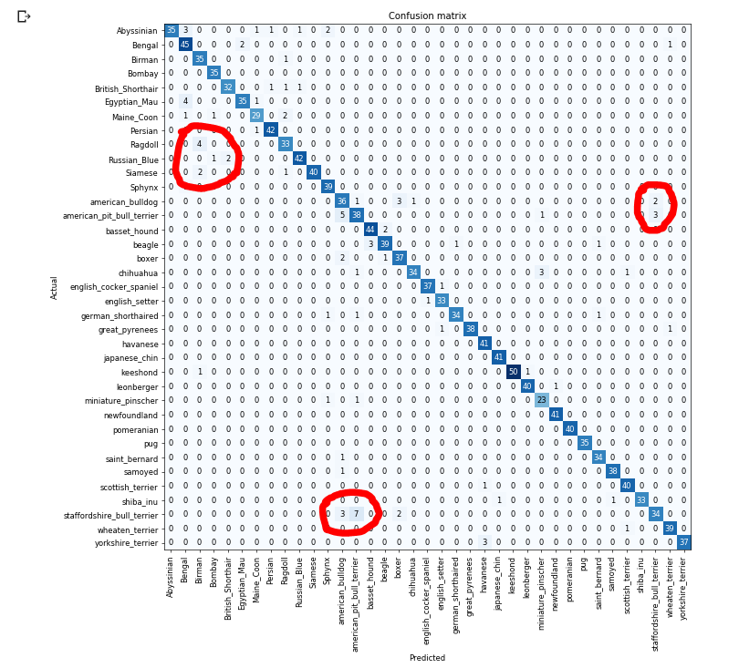

This third part will go over training a Deep Learning Model to differentiate the different pets and breeds from our image dataset. We won't go much into how it works due to time constraints on the Offer Holder Day.

# Getting Started
The first step to training our model is to create a Convolutional Neural Network Learner (CNN Learner), for this to work we need to supply it with a model to modify. We are going to use a Pretrained model for this called ResNet.

##### What is a Pre-trained Model?
A pre-trained model has been previously trained on a dataset and contains the weights and biases that represent the features of whichever dataset it was trained on. Learned features are often transferable to different data. For example, a model trained on a large dataset of bird images will contain learned features like edges or horizontal lines that you would be transferable your dataset.

##### Why use a Pre-trained Model?
Pre-trained models are beneficial to us for many reasons. By using a pre-trained model you are saving time. Someone else has already spent the time and compute resources to learn a lot of features and your model will likely benefit from it.

## Creating the Learner
To create the Learner we can just simply type the following:

```python
learn = cnn_learner(data, models.resnet34, metrics=error_rate)
```

When you run that cell, the ResNet34 Pretrained model will be downloaded!

## Training the Model
Now we can train the model! Type the following into a new code cell and run it!

```python
learn.fit_one_cycle(4)
```

# Interpreting the Results
After around 6 minutes, your model should be trained fairly well, this can be determined by the `error_rate`.


The error rate is a percentage of how many times our model was wrong at guessing the pet breed. At the end of training, this is only 6%! (`0.067659`) This means our model is already 94% accurate at identifying the type of Pet!

# Saving the Model
We can then save the model using the following code so we don't lose our progress:

```python
learn.save('stage-1')
```

## Seeing where it went wrong
There are multiple methods for seeing where the model got confused, this can be done using the Learner Interpreter class, we can create one using:

```python
learner_interpretation = ClassificationInterpretation.from_learner(learn)
```

This will then allow us to view where the model got confused:

### Confusion Matrix
To generate a confusion matrix to see all of the wrong guesses in a neat format use the following:

```python
learner_interpretation.plot_confusion_matrix(figsize=(12,12), dpi=60)
```

This will give you a Matrix Graph with all of the Pet Breeds on each axis. The left axis is what the image actually was, and the bottom axis is what the model predicted it as, we can see a nice clean diagonal blue line of all the correct guesses.
Then the wrong guesses are scattered around (I've highlighted some in red in the image below).


##
# Next Tutorial!
Now you can move on to the next tutorial, where we will actually Train a model from the `ImageDataBunch` that we have just created!

